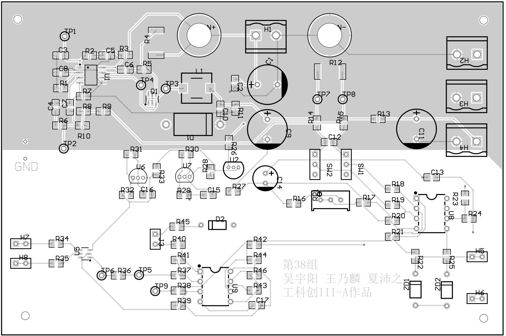

# WindBorne Systems — PCB Design Challenge

**Applicant:** Peizhi Xia  
**Role:** Embedded Electrical Engineer  
**Contact:** peizhix@uci.edu

## Project

**TPS40200 DC-DC Switching Supply and MCU Monitoring System**

This was a team course project. I completed approximately **80% of the PCB placement and routing** in Altium Designer and integrated the power-conversion, current-regulation/current-sharing, and MCU-monitoring sections into one board.

### Design targets

- Input: 10–20 V
- Output: 5 V / 1 A
- Ripple target: ≤100 mVpp
- Full-load efficiency target: ≥80%
- Tools: Altium Designer, TINA-TI, oscilloscope, DMM, programmable supply/load



## Feature I am proud of

The feature I would describe as “simple but useful” is the **loop-aware functional zoning combined with testability**:

- High-current switching and bulk-energy components were kept together to reduce switching-loop area.
- Low-level sensing, feedback, current-sharing, and MCU-monitoring circuitry were placed away from the noisier power region.
- Sense routes were kept separate from high-current paths where practical.
- Test points were placed around important control and measurement nodes so subsystems could be checked independently during bring-up.

The goal was not visual symmetry. The goal was to make the board easier to debug and to keep the most noise-sensitive signals away from the highest di/dt paths.

## Build and validation status

- The **first voltage-regulator stage was physically built and bench-tested**.
- I measured output voltage, line/load behavior, ripple, and efficiency.
- The complete multi-stage board remained a **design artifact** because of course constraints and was not fabricated as a finished board.
- The repository includes the original Altium project files so the design can be inspected directly.

## Layer-stack clarification

The Altium PCB source links **Top Layer directly to Bottom Layer**, so this should be described as a **two-layer copper PCB**. The three-page fabrication export is three exported views/pages, not a three-layer stackup.

## Ownership and attribution

This is a team project. I am not claiming sole ownership of the whole electrical system. My contribution was approximately 80% of PCB placement/routing plus integration and documentation work described above.

## Repository contents

```text
.
├── README.md
├── images/
│   └── TPS40200_board_layout.png
├── docs/
│   └── TPS40200_fabrication_export.pdf
├── source_altium/
│   ├── G38TPS40200CC.PrjPcb
│   ├── G38TPS40200CC.PcbDoc
│   └── G38TPS40200CC.SchDoc
└── application/
    ├── application_payload_template.json
    ├── submit_windows_powershell.ps1
    ├── submit_mac_linux.sh
    └── submit_python.py
```

## Notes

- The source files are included for technical review.
- No proprietary employer material is included.
- The course-provided EECS 267 boost-converter PCB is **not** presented here as my own PCB design.
